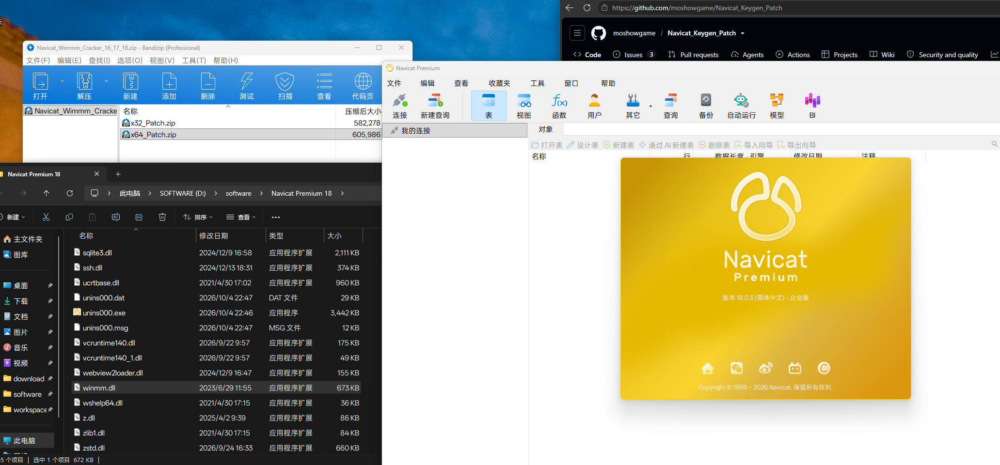

# 🗂️ Navicat_Keygen_Patch / Navicat学习资源合集

> ⚠️ **Important Notice / 重要声明**
> - **English**: This repository is for learning and research purposes only. Please delete within 24 hours.
> - **中文**: 本仓库仅供学习和研究使用，请于24小时内删除。

---

## 🆓 官方免费版推荐 / Official Free Edition（学习首选）

**Navicat 官方已推出免费精简版 [Navicat Premium Lite](https://www.navicat.com.cn/products/navicat-premium-lite#)** —— 无需任何补丁、合法合规，个人学习与轻度开发的首选！

**English**: Navicat Premium Lite is the official free edition of Navicat. It covers the core features for daily database operations and is free for both commercial and non-commercial use — the best choice for learning and light-weight development.

| 项目 / Item | 说明 / Description |
|-------------|-------------------|
| 📥 官方下载 / Download | [Navicat Premium Lite 免费下载](https://www.navicat.com.cn/download/navicat-premium-lite) |
| 💻 支持平台 / Platform | Windows / macOS / Linux |
| 🗄️ 支持数据库 / Databases | MySQL、PostgreSQL、SQL Server、Oracle、SQLite、MariaDB、MongoDB、Redis、Snowflake |
| 🇨🇳 国产数据库兼容 / Domestic DB | 达梦、金仓、GaussDB、OceanBase、TiDB、IvorySQL、PolarDB |
| ☁️ 云平台支持 / Cloud | 阿里云、腾讯云、华为云、AWS、Azure、Google Cloud、MongoDB Atlas 等 |
| 👥 授权条款 / License | 可用于**商业和非商业**用途；每家机构最多 **5 个**免费用户账户 |

> 🛒 **购买完整正版 / Purchase Full Version**
> - **English**: If you need full features, buy from official store: [Navicat Official Store](https://www.navicat.com.cn/store/navicat-premium-plan)
> - **中文**: 如需完整功能（如数据传输、结构同步、数据模型设计等），请购买正版：[Navicat官方商店](https://www.navicat.com.cn/store/navicat-premium-plan)

---

**✅ Latest Verified Version / 最新验证可用版本 : `V18.0.3` on `2026-10-04`**

⚡ Navicat Wimmm DDL Patch - 已支持 Navicat 18 ！

## 📋 Repository Overview / 仓库内容概览

| Tool Name / 工具名称 | Supported Versions / 支持版本 | Type / 类型 | Status / 状态 |
|-------------------|---------------------------|-------------|---------------|
| 🆓 [Navicat Premium Lite](https://www.navicat.com.cn/products/navicat-premium-lite#) | 最新版 / Latest | 官方免费版 / Official Free | ✅ 学习首选，无需补丁 |
| 🛠️ Navicat Wimmm Cracker | 16/17/18 | DLL Patch / DLL补丁 | ⭐⭐⭐⭐⭐ 最新推荐，支持 Navicat 18 |
| 🔧 Navicat Keygen Patch | 15/16/17 | Activation Tool / 激活工具 | out-off-date / 旧版可用 |
| 🔄 Navicat Trial Reset | 15/16/17/18 | Trial Reset / 试用重置 | ⭐Available / v18也可用，15天执行一次重置 |
| 🚀 NavicatCracker | 16.X | Crack Tool / 破解工具 | Demise / 仅用于16版本 |

## 🎯 Usage Guide / 使用指南

### 📥 Step 1: Download Resources / 第一步：下载资源
- **中文**: 下载学习资源包 [Navicat_Wimmm_Cracker_16_17_18.zip](https://github.com/moshowgame/Navicat_Keygen_Patch/blob/main/Navicat_Wimmm_Cracker_16_17_18.zip)
- **English**: Download the study resource package
- 📖 详细图文教程 / Illustrated Guideline: [NavicatCracker_guideline.png](./NavicatCracker_guideline.png)

### 💻 Step 2: Install Navicat / 第二步：安装 Navicat
- **中文**: 下载并安装 Navicat Premium 16/17/18（仅用于学习时，更推荐官方免费版 [Navicat Premium Lite](https://www.navicat.com.cn/products/navicat-premium-lite#)）
- **English**: Download and install Navicat Premium 16/17/18. For learning purposes, the official free [Navicat Premium Lite](https://www.navicat.com.cn/products/navicat-premium-lite#) is recommended.

### 🔒 Step 3: Close Program / 第三步：关闭程序
- **English**: Close Navicat completely before proceeding
- **中文**: 安装完成后请勿打开 Navicat，如已打开请先完全退出

### 🔧 Step 4: Apply Patch / 第四步：应用补丁
- **English**: Unzip and place the correct `winmm.dll` (match your system architecture) into the Navicat installation folder
- **中文**: 解压并将对应系统版本的 `winmm.dll` 放置到 Navicat 安装目录

### ✅ Step 5: Complete / 第五步：完成
- **English**: Finish! Ready to use 🎉
- **中文**: 完成！可以开始使用了 🎉

## 🔬 Latest Verification Information / 最新验证信息

| 项目 / Item | 详情 / Detail |
|-------------|--------------|
| ✅ 验证版本 / Verified Version | `Navicat Premium V17.3.6` |
| 📅 验证日期 / Verified Date | `2025-11-30` |
| 🛠️ 验证工具 / Verified Tool | 🛠️ Navicat Wimmm Cracker（`winmm.dll` 方式，支持 16/17/18） |

## 👨‍💻 Project Contributors / 项目贡献者

| Tool Name / 工具名称 | Original Author / 原作者 | Collector / 收集者 |
|-------------------|------------------------|-------------------|
| 🔧 Navicat Keygen Patch | DFoX | zhengkai.blog.csdn.net |
| 🔄 Navicat Reset Patch | Anonymous Developer / 匿名开发者 | zhengkai.blog.csdn.net |
| 🚀 NavicatCracker | tgMrz@DoubleSine | zhengkai.blog.csdn.net |
| 🛠️ Navicat Wimmm Cracker | ajiajishu | zhengkai.blog.csdn.net |

## 📝 Important Notes / 注意事项

### ⚠️ Usage Guidelines / 使用规范
- **中文**: 使用「试用重置」方案（`navicat16 trial reset batch.bat`，通过清理注册表重置试用）时，每半个月需执行一次；使用 Wimmm DLL 补丁方案时，放置 `winmm.dll` 一次即可，无需重复操作。
- **English**: If using the trial-reset solution (`navicat16 trial reset batch.bat`), run it every half month; the Wimmm DLL patch is a one-time setup only.

### 🔒 Legal Compliance / 法律合规
- **English**: For learning and research only, not for commercial use. For commercial scenarios, please use the official free edition or purchase a license.
- **中文**: 仅供学习研究，请勿用于商业用途；商业场景请使用官方免费版或购买正版。

### 📚 Security Recommendations / 安全建议
- **English**: Recommended to test in a virtual machine environment
- **中文**: 建议在虚拟机环境中测试使用

### 🚫 Disclaimer / 免责声明
- **English**: Use at your own risk, authors assume no responsibility
- **中文**: 使用风险自负，作者不承担任何责任

---

**💡 Friendly Reminder / 温馨提示**
- **中文**: 如果 [Navicat Premium Lite](https://www.navicat.com.cn/products/navicat-premium-lite#) 免费版已满足你的需求，请直接使用官方免费版；如需更多功能，请支持正版软件，享受更好的技术支持和更新服务！
- **English**: If the official free [Navicat Premium Lite](https://www.navicat.com.cn/products/navicat-premium-lite#) meets your needs, just use it. Otherwise, support official software for better technical support and updates!
